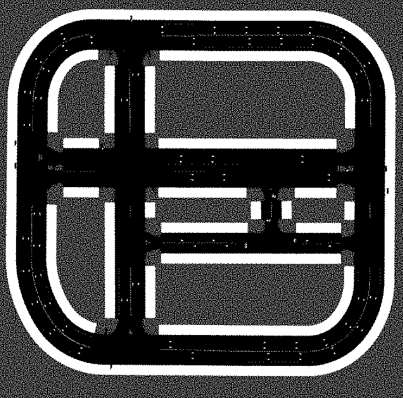
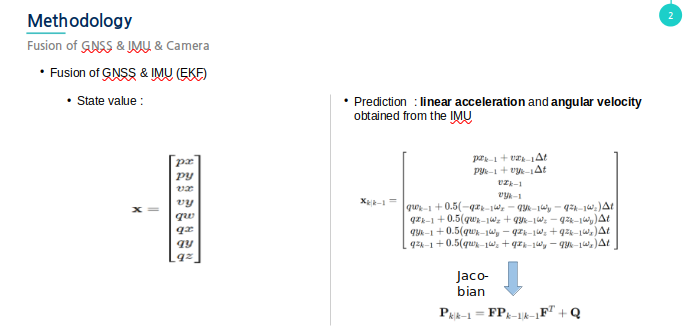
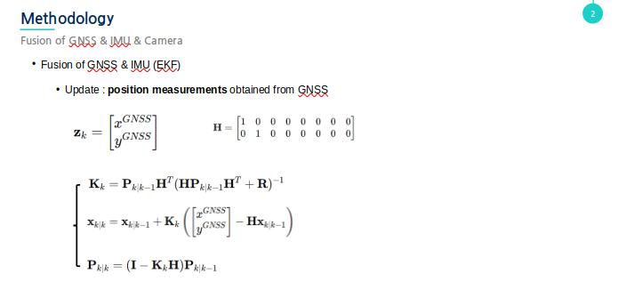
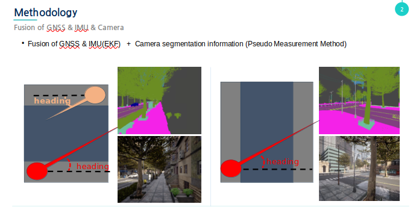
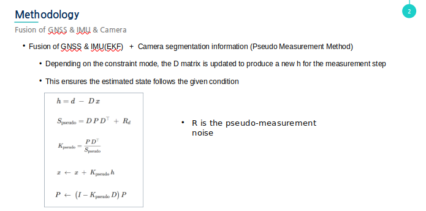
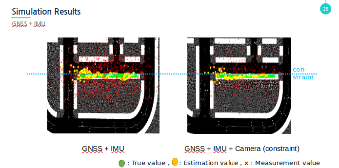
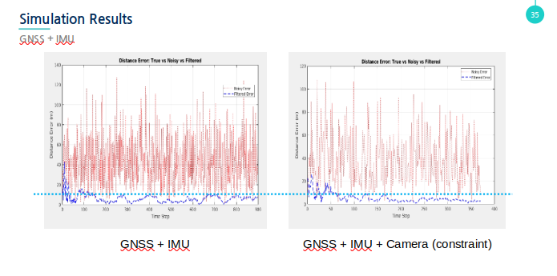

# Constraint Filtering 기반 모바일 로봇 위치추정 프로젝트

## 프로젝트 개요
도심 환경에서 모바일 로봇은 보행자와 동일한 규제를 따르며, **인도 및 횡단보도**를 통해서만 이동해야 합니다. 본 프로젝트는 **GNSS(Global Navigation Satellite System)와 IMU(Inertial Measurement Unit)** 데이터를 기반으로 위치추정 정확도를 높이고, 충돌 회피 및 효율적인 작업 할당을 가능하게 하는 방법론을 제시합니다.

기존 GNSS+IMU 보정 방식에 **Constraint Filtering**을 적용한 EKF(Extended Kalman Filter)를 사용하여 보다 정교한 위치추정을 실현하며, 현실감 있는 데이터를 위해 **CARLA Simulator**를 활용하여 시뮬레이션을 수행했습니다.

---

## 주요 내용

### 1. **위치추정 방법론**
- 기존 GNSS+IMU 방식의 한계:
  - 도심 지역에서 GNSS 신호 노이즈가 발생.
  - IMU 측정값을 GNSS 측정값으로 보정하는 기존 방식은 GNSS 의 노이즈에 따라 오차가 존재할 수 밖에 없음

- 해결책:
  - **Constraint Filtering**을 EKF에 통합하여 인도와 횡단보도라는 환경적 제약을 모델링.
  - 도로 및 보행 환경을 고려한 위치추정 보정.

### 2. **시뮬레이션 환경**
- **CARLA Simulator**:
  - 차량 중심의 시뮬레이션 환경을 보행자 및 모바일 로봇 환경으로 변환.
  - 보행자 모델을 사용하여 도로 중심성 및 인도 위치를 세그먼테이션(segmentation)으로 표현.
  - 향후 모바일 로봇 또는 차량 모델 적용 가능성.

### 3. **확장 가능성**
- **모바일 로봇**:
  - GNSS+IMU 기반 위치추정을 통해 충돌 회피 및 경로 최적화.
- **차량 모델**:
  - 도로의 쌍방향성을 고려한 위치추정 및 자율주행 경로 계획.

---

## Future direction & Expected Outcome
1. **안전성 강화**: 
   - 정확한 위치추정을 통해 충돌 회피를 실현.
2. **효율성 향상**: 
   - 작업 할당 및 경로 계획에서의 효율성 증대.
3. **실용성 증대**: 
   - 도심 배달로봇 및 차량 자율주행 등 다양한 분야에 적용 가능.

---

## 설치 및 실행 방법

### 1. **필수 소프트웨어**
- **운영체제**: Ubuntu 22.04
- **ROS2**: Humble
- **CARLA Simulator**: 0.9.4 
- Map : Town 10


### 2. **설치 필요**
```bash
carlasim

carla-ros-bridge
  -> go.py : rviz2 에서 goal 의 정보를 받아 walker 가 움직이도록 제어하는 코드
  -> test.py : sensor 와 segmentation 관련 후처리 ros2 topic 발행 코드

matlab
  -> imu_gnss.m : imu와 gnss 에 대한 기존 방식을 활용한 ekf estimation value 시각화
  -> contstraint.m : 카메라의 segmentation 정보와 추정된 heading 값을 활용한 ekf estimation value 시각화

```

## Reference

https://github.com/carla-simulator






